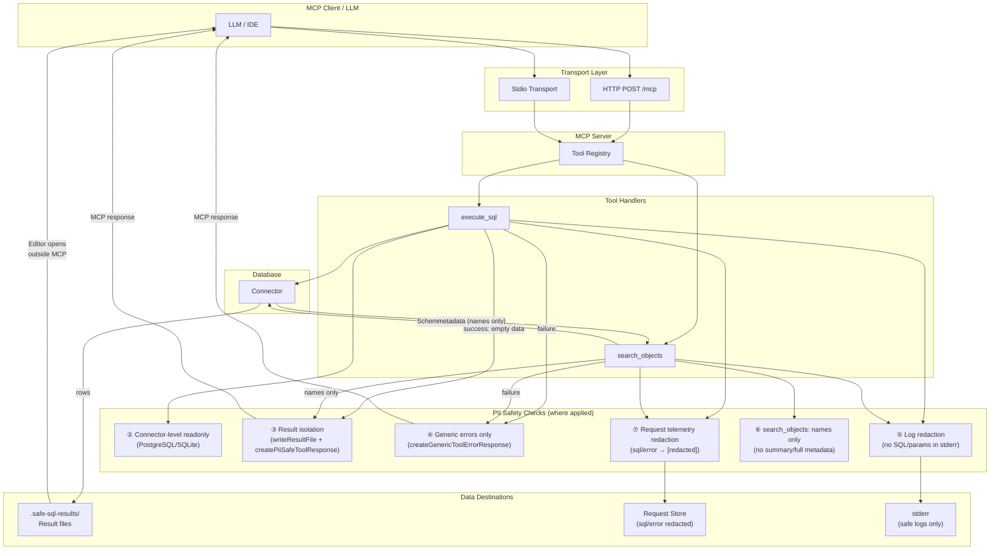

# Architecture

This document describes the architecture of capybara-db-mcp, with emphasis on PII safety and the mechanisms that prevent database-derived data from being exposed to LLMs.

**Related documentation:**
- [AGENTS.md](AGENTS.md) — Development guidelines, security model summary, configuration
- [README.md](README.md) — Project overview, installation, MCP tools
- [docs/README.md](docs/README.md) — Documentation index and controls overview

---

## Table of Contents

1. [Overview](#overview)
2. [Information Flow and PII Safety (Mermaid Diagram)](#information-flow-and-pii-safety-mermaid-diagram)
3. [Directory Structure](#directory-structure)
4. [Transport and Server Layer](#transport-and-server-layer)
5. [PII Safety Mechanisms (Detail)](#pii-safety-mechanisms-detail)
6. [Read-Only Enforcement](#read-only-enforcement)
7. [Connector Architecture](#connector-architecture)
8. [Request Telemetry and API](#request-telemetry-and-api)
9. [Configuration Flow](#configuration-flow)

---

## Overview

capybara-db-mcp is a minimal readonly, PII-safe database MCP server. Its core design goal is to **reduce the likelihood of transmitting query result data, database error text, SQL statements, or schema metadata to an LLM**. All tool responses are intentionally sparse; result data stays in local files and is never included in the MCP response payload.

---

## Information Flow and PII Safety (Mermaid Diagram)

The diagram below shows how data flows from the LLM/MCP client through tool handlers to the database and back, and where PII-safety checks are applied.



**Legend for checks:**

| # | Check | Location | Purpose |
|---|-------|----------|---------|
| ② | Connector-level readonly | `manager.ts`, PostgreSQL/SQLite | `config.readonly = true` at connection; enforces `default_transaction_read_only` or file readonly. Write operations fail at DB level. |
| ③ | Result isolation | `result-writer.ts`, `response-formatter.ts` | Rows written to `.safe-sql-results/`; tool response returns `{ success: true, data: {} }` only |
| ④ | Generic errors | `response-formatter.ts`, all tool handlers | "Execution failed. See server logs for details." — no DB error text, SQL, or params |
| ⑤ | Log redaction | Tool handlers, connectors | Stderr logs: `[tool] Execution failed` — never SQL or parameter values |
| ⑥ | search_objects names only | `search-objects.ts` | `detail_level` forced to `names`; no `column_count`, `row_count`, `columns`, `definition`, etc. |
| ⑦ | Request telemetry redaction | `tool-handler-helpers.ts`, `api/requests.ts` | `trackToolRequest` and API responses use `[redacted]` for `sql` and `error` |

---

## Directory Structure

```
src/
├── connectors/           # Database-specific implementations
│   ├── postgres/         # PostgreSQL (readonly via default_transaction_read_only)
│   ├── mysql/            # MySQL
│   ├── mariadb/          # MariaDB
│   ├── sqlite/           # SQLite (readonly mode for file DBs)
│   ├── sqlserver/        # SQL Server
│   ├── manager.ts        # Multi-source connection management
│   └── interface.ts      # Connector interface
├── tools/                # MCP tool handlers
│   ├── execute-sql.ts    # Ad-hoc SQL execution (PII-safe response)
│   ├── search-objects.ts # Schema/object search (names only)
│   ├── registry.ts       # Tool registration
│   └── builtin-tools.ts
├── utils/
│   ├── response-formatter.ts  # createPiiSafeToolResponse, createGenericToolErrorResponse
│   ├── result-writer.ts       # Writes to .safe-sql-results/
│   ├── sql-parser.ts          # stripCommentsAndStrings (used by sql-row-limiter)
│   ├── tool-handler-helpers.ts # trackToolRequest (redacts sql/error)
│   └── dsn-obfuscator.ts      # DSN redaction for logs
├── requests/             # In-memory request tracking
│   └── store.ts
├── api/                  # HTTP API endpoints
│   ├── requests.ts       # GET /api/requests (redacts sql/error)
│   └── sources.ts
├── config/               # Configuration resolution
│   ├── env.ts            # Bind address, DSN, etc.
│   └── toml-loader.ts
└── server.ts             # Express + MCP transport, CORS, bind address
```

---

## Transport and Server Layer

### Transports

- **Stdio**: Default for desktop MCP clients (Cursor, Claude Desktop). No network exposure.
- **HTTP**: `StreamableHTTPServerTransport` with JSON responses (stateless; no SSE). Endpoint: `POST /mcp`.

### HTTP Hardening (PII / Network Safety)

| Setting | Default | Purpose |
|---------|---------|---------|
| **Bind address** | `127.0.0.1` | Server only listens locally. Use `--bind=0.0.0.0` or `BIND_ADDRESS` for network access. |
| **CORS** | Strict allowlist | `http://localhost`, `http://127.0.0.1`, `http://localhost:{port}`, `http://127.0.0.1:{port}`, `http://localhost:5173` |
| **Methods** | GET, POST, OPTIONS | Limited to what is needed. |
| **Headers** | `Content-Type`, `Mcp-Session-Id` | Minimal allowed headers. |

Implementation: `src/server.ts`, `src/config/env.ts` (`resolveBindAddress`).

---

## PII Safety Mechanisms (Detail)

### 1. Result Isolation (No Query Data in MCP Response)

**Intent:** Query result rows must never appear in the tool response returned to the LLM.

**Mechanism:**

- `writeResultFile()` (result-writer.ts) writes rows to `.safe-sql-results/<timestamp>_<tool>.csv|json|md`.
- The file is opened in the user's editor via `EDITOR_COMMAND` / `cursor` / `code`.
- `createPiiSafeToolResponse()` returns only:

  ```json
  { "success": true, "data": {} }
  ```

- No file path, row count, column names, or source ID are included.

**Files:** `src/utils/result-writer.ts`, `src/utils/response-formatter.ts`, `src/tools/execute-sql.ts`.

### 2. Generic Error Responses (No DB Error Text)

**Intent:** Database error messages often contain schema names, table names, or hints that could leak structure or PII.

**Mechanism:**

- On execution/search failure, tools call `createGenericToolErrorResponse("EXECUTION_ERROR")` or `createGenericToolErrorResponse("SEARCH_ERROR")`.
- The client receives: `"Execution failed. See server logs for details."` or `"Search failed. See server logs for details."`
- No SQL, parameter values, or `error.message` from the database are returned.

**Files:** `src/utils/response-formatter.ts`, `src/tools/execute-sql.ts`, `src/tools/search-objects.ts`.

### 3. Log Redaction (No SQL or Params in stderr)

**Intent:** Stderr may be captured or forwarded; it must not contain SQL or parameter values.

**Mechanism:**

- Tool handlers log only: `[execute_sql] Execution failed`, `[search_objects] Search failed`.
- Connector `executeSQL` catch blocks log: `[PostgreSQL executeSQL] Execution failed`, `[MySQL executeSQL] Execution failed`, etc.

**Files:** All tool handlers, all connector `executeSQL` implementations.

### 4. search_objects: Names Only

**Intent:** `summary` and `full` detail levels return metadata (row counts, column types, procedure definitions) that could reveal structure or PII.

**Mechanism:**

- Schema restricts `detail_level` to `"names"` only.
- Handler forces `effectiveDetailLevel = "names"` regardless of input.
- Results contain only: `{ name, schema? }` or `{ name, table, schema }` — no `column_count`, `row_count`, `columns`, `indexes`, `definition`, etc.

**Files:** `src/tools/search-objects.ts`, `src/utils/tool-metadata.ts`.

### 5. Request Telemetry Redaction

**Intent:** The `/api/requests` endpoint and in-memory store must not expose SQL or error text.

**Mechanism:**

- `trackToolRequest()` always stores `sql: "[redacted]"` and `error: "[redacted]"` (when present).
- `listRequests` in `api/requests.ts` applies `redactRequest()` so `sql` and `error` in the JSON response are `"[redacted]"`.

**Files:** `src/utils/tool-handler-helpers.ts`, `src/api/requests.ts`, `src/requests/store.ts`.

### 6. Connector-Level Read-Only

See [Read-Only Enforcement](#read-only-enforcement).

---

## Read-Only Enforcement

Connections are opened in read-only mode. UPDATE, DELETE, INSERT, MERGE, and other write operations fail at the database level (e.g., `ERROR: cannot execute UPDATE in a read-only transaction` for PostgreSQL).

| Connector | Mechanism |
|-----------|-----------|
| **PostgreSQL** | `config.readonly = true` → appends `-c default_transaction_read_only=on` to connection options. |
| **SQLite** | `config.readonly = true` → opens file-based DBs with `readonly: true` (skipped for `:memory:`). |
| **MySQL/MariaDB/SQL Server** | No SDK-level readonly; rely on database user permissions and RBAC. |

`ConnectorManager.connectSource()` unconditionally sets `config.readonly = true` when calling `connector.connect()`.

**Files:** `src/connectors/manager.ts`, `src/connectors/postgres/index.ts`, `src/connectors/sqlite/index.ts`.

---

## Connector Architecture

### Connector Interface

Each connector implements:

- `connect(dsn, initScript?, config?)` — establish connection; `config.readonly` used by PostgreSQL and SQLite.
- `executeSQL(sql, options?, params?)` — run query; returns `{ rows, rowCount }`.
- Schema introspection: `getSchemas`, `getTables`, `getTableSchema`, `getTableIndexes`, `getStoredProcedures`, etc.
- `clone()` — for multi-source support.

### Connector Manager

- Holds `Map<sourceId, Connector>`.
- Supports lazy connection for sources marked `lazy: true` in TOML.
- SSH tunnels: when `ssh_host` is set, establishes tunnel before connecting.
- First source is the default when `source_id` is omitted.

**Files:** `src/connectors/interface.ts`, `src/connectors/manager.ts`.

---

## Request Telemetry and API

### In-Memory Store

- `RequestStore` holds up to 100 requests per source (FIFO eviction).
- Each request: `id`, `timestamp`, `sourceId`, `toolName`, `sql`, `durationMs`, `client`, `success`, `error?`
- `trackToolRequest()` writes `sql: "[redacted]"` and `error: "[redacted]"`; raw values are never stored.

### API Endpoints

- `GET /api/requests` — list requests, optionally filtered by `source_id`.
- `GET /api/requests?source_id=prod_pg` — filter by source.
- `redactRequest()` ensures `sql` and `error` are `"[redacted]"` in the JSON response.

**Files:** `src/requests/store.ts`, `src/api/requests.ts`, `src/utils/tool-handler-helpers.ts`.

---

## Configuration Flow

1. **Command-line** (highest priority): `--dsn`, `--config`, `--bind`, `--output-format`, etc.
2. **TOML file** (`dbhub.toml`): `[[sources]]`, `[[tools]]`, per-source and per-tool settings.
3. **Environment variables**: `DSN`, `BIND_ADDRESS`, etc.
4. **`.env` files**: `.env.local` (development), `.env` (production).

Key PII-related settings:

- `--bind` / `BIND_ADDRESS`: default `127.0.0.1`.
- `--output-format`: `csv`, `json`, or `markdown` for result files.

---

## Summary: What Never Reaches the LLM

| Data Type | Handled By | LLM Receives |
|-----------|------------|--------------|
| Query result rows | Result isolation | Nothing (stored in local files, opened in editor) |
| File path, row count, column names | `createPiiSafeToolResponse` | None |
| DB error messages | `createGenericToolErrorResponse` | Generic message only |
| SQL statements | Log redaction, request redaction | Never in logs or API |
| Parameter values | Log redaction | Never in logs |
| Schema metadata (row counts, column types, definitions) | `search_objects` names-only | Names only |
| Request telemetry (sql, error) | `trackToolRequest`, `redactRequest` | `[redacted]` |

These mechanisms reduce the likelihood of LLM exposure to database-derived PII. They do not replace formal security review, DLP, or database-level access controls.
